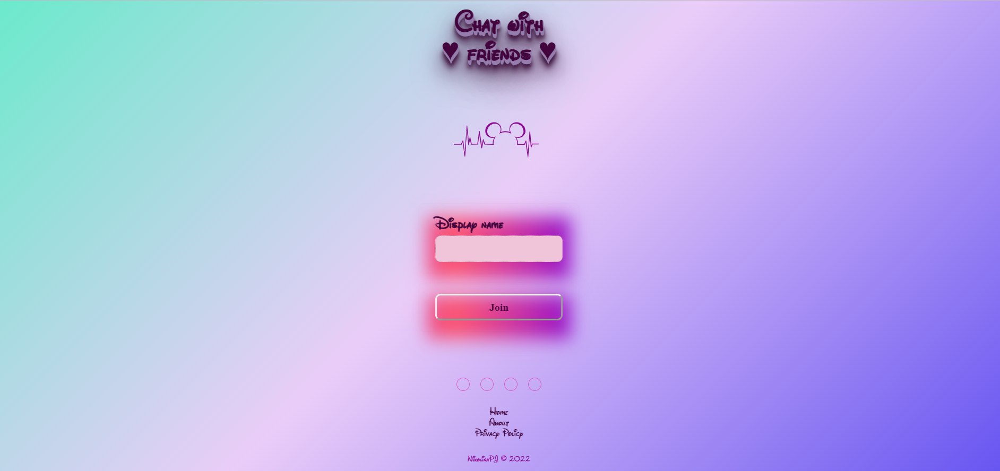

# Chat-App

<div aling="center">
    <br/>
        
        <br/>
        
        <br/>
        <b>
        This is Real-time chat application using JavaScript, React, SCSS, and Scaledrone.
        Developed as part of Algebra's Frontend developer course.
        </b>
    <br/>
    <br/>   
</div>

[**Try me on Netlify**](https://nikolinapj-chat-app.netlify.app//)

---

## Getting started

**Requirements**

- Node.js 16.15.0+
- npm 8.5.5+
- Scaledrone channel ID

**First steps & instalation**

1. Clone this repository

Install it locally using npm:   

2. Run `npm install`
3. Run `npm start`

## Scripts
---

### `npm run start`

Start the development environment.

### `npm run build`

Build the project for production.

---

## Connect to Scaledrone

You can create your Scaledrone channel for free using this [link](https://www.scaledrone.com).\
To connect to the channel you need to paste your channel ID in MyChatApp.jsx component,
or with .env file with environment variable _REACT_APP_SCALEDRONE_CHANNEL_ID_

```javascript
/* Scaledrone channel ID goes here */
const CHANNEL_ID =
  `${process.env.REACT_APP_SCALEDRONE_CHANNEL_ID}` || "{CHANNEL_ID_GOES_HERE}";
```

---

## Features

- [x] Create text messages
- [x] Send text message by pressing "Enter" or the submit button (message is shown next to the name of the author)
- [x] Every chat room member is identifiable by name and colour
- [x] Integrate with Scaledrone to provide real-time chat functionality
- [x] Host as GitHub repository

---

- [ ] "Typing..." indic
- [ ] Connect Footer through Router
- [ ] Select your avatar
- [ ] Member list with all users
- [ ] Inform when new member joins the room
- [ ] Inform when member leaves the room

